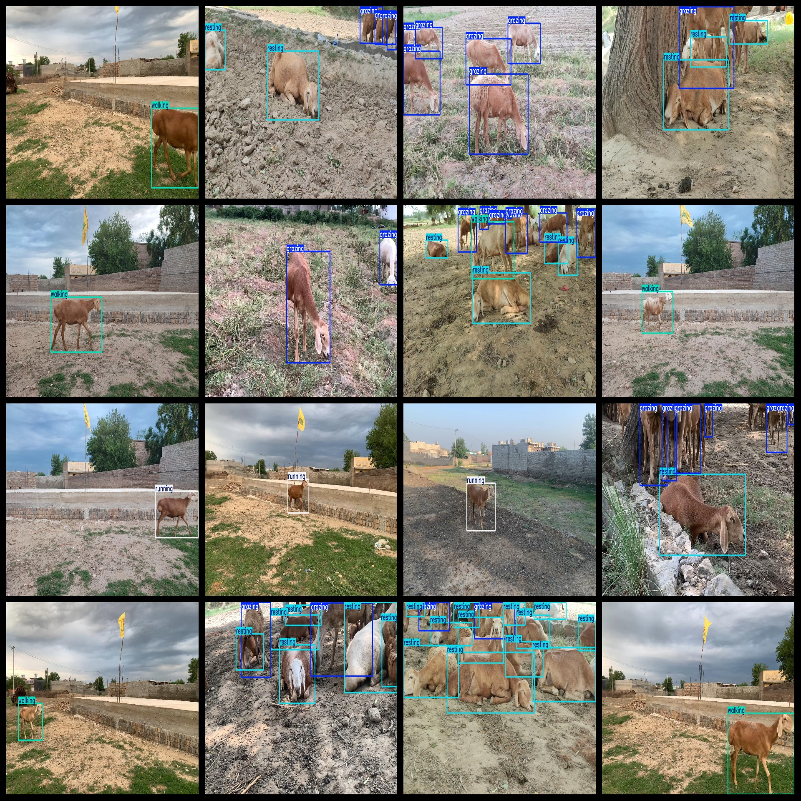
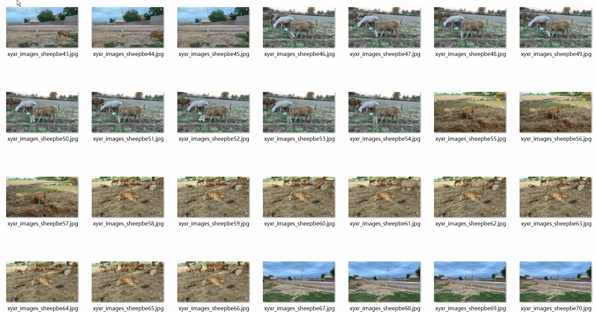

# Sheep Behavior Detection Dataset 2276 imagesVOC+YOLO format

The 2276 sheep behavior detection dataset is in the format of VOC+YOLO.

Dataset format: Pascal VOC format + YOLO format (the txt file does not contain the split path, it only contains jpg images and corresponding VOC format xml files and yolo format txt files)

Number of image files: 2276

Number of XML files: 2,276

Number of TXT files: 2276

Number of annotated categories: 4

The Github repository is: datasets_sl

["grazing", "resting", "running", "walking"]

Tags Chinese Translation: "Feeding grass", "Rest", "Running", "Walking"

Number of boxes labeled in each category:

The English translation is: "Number of frames = 4502"

The English translation is: "Number of frames = 1446".

Number of runs = 500

walking frame count = 942

Total Frames: 7390

Number of images per category:

Grazing occupies 888 images.

The number of images owned by "resting" is 422.

running annotated images = 500

Walking occupies 882 pictures.

Image resolution: 1280x720

Use the labeling tool: labelImg

Dataset Augmentation: No

Rules for annotation: Draw a rectangle around the category.

Important note: The dataset does not have been divided into training, validation, and testing sets.

Special Disclaimer: This dataset does not guarantee the accuracy of the trained models or weight files.

Annotation and image details are as follows:

## Images

---

Here is a pay link on Stripe (https://buy.stripe.com/3cs8yP7sY87d0vu9AB). Please contact me lonlonago@foxmail.com after funding $89, and I will send you a complete data files, thank you!

